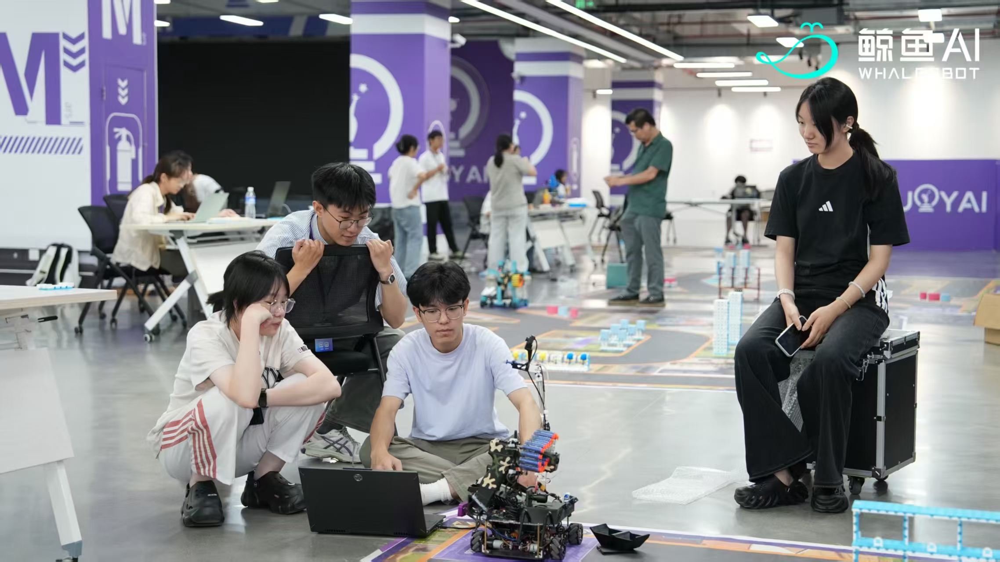
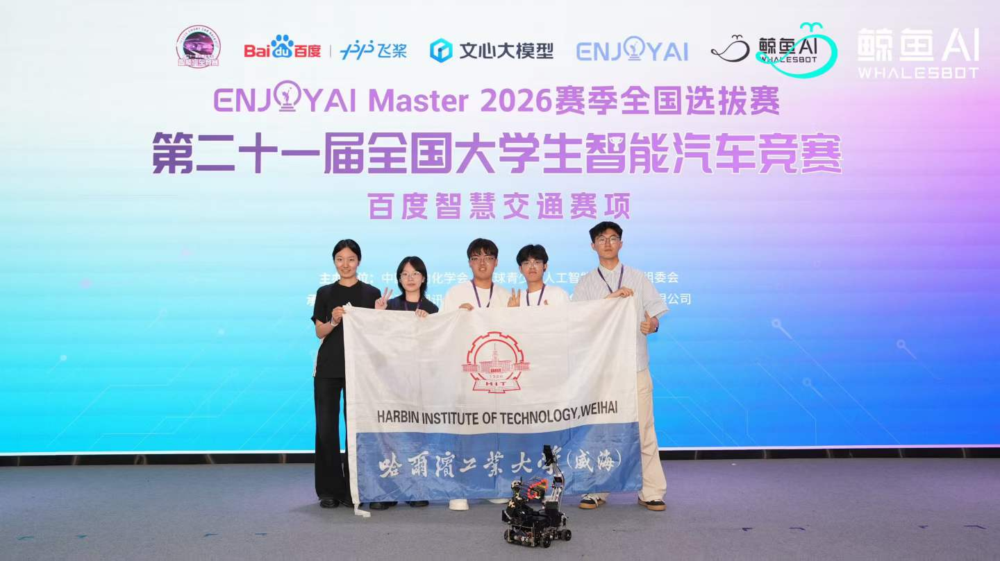

# Hi, I'm Lyu Ziheng

English | [中文](#中文)

I am a junior student at Harbin Institute of Technology, Weihai.

I am interested in robotics, embodied intelligence, and embedded systems. In my free time, I enjoy calligraphy, photography, and music.

<p align="center">
  
  
</p>

## About Me

- Junior student at HIT Weihai
- Interested in robotics and embedded AI
- Working mainly with Python, C, Linux, and Jetson

## Technical Interests

- Robotics software architecture
- Embodied intelligence
- Computer vision and object detection
- Embedded Linux development
- Jetson edge deployment
- UART communication and real-time control
- Robotic-arm calibration and control
- Practical AI workflows for physical robots

## Tech Stack

```text
Python / C / OpenCV / Paddle Lite / Linux / Git
Jetson Orin Nano / UART / OCR / AI Studio API
```
---

## 中文

[English](#hi-im-lyu-ziheng) | 中文

我是哈尔滨工业大学（威海）大三学生。

目前关注机器人、具身智能和嵌入式系统。平时喜欢书法、摄影和音乐。

## 关于我

- 哈尔滨工业大学（威海）大三学生
- 关注机器人与嵌入式 AI
- 主要使用 Python、C、Linux 和 Jetson

## 技术方向

- 机器人软件架构
- 具身智能
- 计算机视觉与目标检测
- 嵌入式 Linux 开发
- Jetson 边缘端部署
- UART 通信与实时控制
- 机械臂标定与控制
- 面向真实机器人的 AI 工作流

## 技术栈

```text
Python / C / OpenCV / Paddle Lite / Linux / Git
Jetson Orin Nano / UART / OCR / AI Studio API
```

